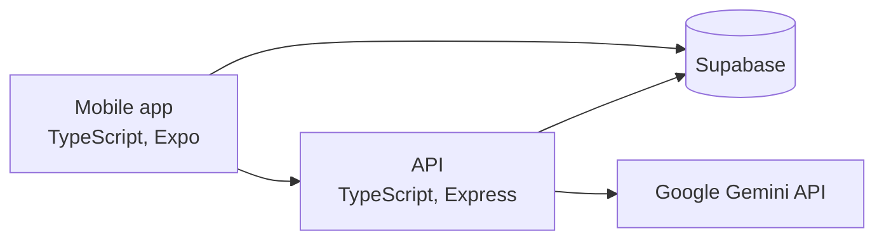

# PokeDate

PokeDate is a location-based mobile dating app modeled on Pokemon Go, where users see nearby people on a map and throw a virtual Pokeball at someone to start a match. It is an Expo React Native app backed by an Express and Socket.IO server that stores profiles, locations, throws and matches in Supabase and uses Google Gemini to rate profile selfies.

